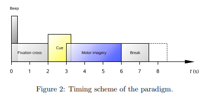
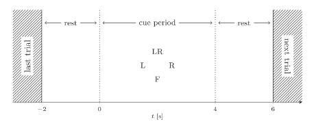

# EEG Motor Imagery Deep Learning

A research repository of deep learning on electroencephalographic (EEG) for Motor imagery(MI), including eeg data 
processing(visualization & analysis), papers(research and summary), deep learning models(reproduction and experiments).

The experiments in this repository is based on the following open source libraries:

- [MNE-Python](https://github.com/mne-tools/mne-python)

  MNE-Python is an open-source Python package for exploring, visualizing, and analyzing human neurophysiological data 
such as MEG, EEG, sEEG, ECoG, and more. It includes modules for data input/output, preprocessing, visualization, source 
estimation, time-frequency analysis, connectivity analysis, machine learning, and statistics.

- [Moabb](https://github.com/NeuroTechX/moabb)

  Moabb: Build a comprehensive benchmark of popular Brain-Computer Interface (BCI) algorithms applied on an extensive 
list of freely available EEG datasets.

- [Braindecode](https://github.com/braindecode/braindecode)

  Braindecode is an open-source Python toolbox for decoding raw electrophysiology brain data with deep learning models. 
It includes dataset fetchers, data preprocessing and visualization tools, as well as implementations of several deep 
learning architectures and data augmentations for analysis of EEG, ECoG and MEG.

You can find more contents of this repository through the following sections:

- [Paper Researching](#paper-researching)
- [EEG Data Analysis and Processing](#eeg-data-analysis-and-processing)
- [Experiments](#experiments)

## Paper Researching

This list of papers currently includes the following areas (being updated):

- [Awesome Paper](#awesome-paper)
- [Public Datasets](#public-datasets)

### Awesome Paper

| Title                                                                                                                                                               | Year | Auth                 | Citation(about) | Model    | Dataset             | Related                                                                                                                                                                                                                                            |
|---------------------------------------------------------------------------------------------------------------------------------------------------------------------|------|----------------------|-----------------|----------|---------------------|----------------------------------------------------------------------------------------------------------------------------------------------------------------------------------------------------------------------------------------------------|
| **Deep learning with convolutional neural networks for brain mapping and decoding of ...** [[Link](https://pubmed.ncbi.nlm.nih.gov/28782865/)]                      | 2017 | Schirrmeister et al. | **1744**        | CNN      | BCI IV 2a           | [[code](https://github.com/robintibor/braindecode)]   [[reproduce1](https://github.com/braindecode/braindecode/tree/master/braindecode/models)]                                                                                                |
| **EEGNet: a compact convolutional neural network for EEG-based brain–computer interfaces** [[Link](https://iopscience.iop.org/article/10.1088/1741-2552/aace8c)]    | 2018 | Lawhern et al.       | **1516**        | CNN      | BCI IV 2a           | [[code](https://github.com/vlawhern/arl-eegmodels)]   [[reproduce1](https://github.com/braindecode/braindecode/tree/master/braindecode/models)]  [[reproduce2](https://colab.research.google.com/drive/1ANF8PwvtUPawTeQt4Uu4iwscpyhHBgvM)] |
| Learning Temporal Information for Brain-Computer Interface Using Convolutional Neural Networks [[Link](https://ieeexplore.ieee.org/document/8310961)]               | 2018 | Sakhavi et al.       | **388**         | CNN      | BCI IV 2a           |                                                                                                                                                                                                                                                    |
| **An end-to-end deep learning approach to MI-EEG signal classification for BCIs** [[Link](https://www.sciencedirect.com/science/article/abs/pii/S0957417418305359)] | 2019 | Dose et al.          | **220**         | CNN      | Physionet           | [[code](https://github.com/hauke-d/cnn-eeg)]                                                                                                                                                                                                       |
| A novel hybrid deep learning scheme for  four-class motor imagery classification [[Link](https://pubmed.ncbi.nlm.nih.gov/31341093/)]                                | 2019 | Zhang et al.         | 97              | CNN+LSTM | BCI IV 2a           |                                                                                                                                                                                                                                                    |
| Multilevel Weighted Feature Fusion Using Convolutional Neural Networks for EEG... [[Link](http://ieeexplore.ieee.org/document/8629079/)]                            | 2019 | Amin et al.          | 143             | CNN      | BCI IV 2a           |                                                                                                                                                                                                                                                    |
| Deep Learning for EEG motor imagery classification based on multi-layer CNNs...[[Link](https://www.sciencedirect.com/science/article/pii/S0167739X19306077)]        | 2019 | Amin et al.          | 237             | CNN      | BCI IV 2a           |                                                                                                                                                                                                                                                    |
| HS-CNN: a CNN with hybrid convolution scale for EEG motor imagery classification [[Link](https://pubmed.ncbi.nlm.nih.gov/31476743/)]                                | 2020 | Dai et al.           | 149             | CNN      | BCI IV 2a           |                                                                                                                                                                                                                                                    |
| An Accurate EEGNet-based Motor-Imagery Brain Computer Interface for Low-Power Edge Computing [[Link](https://arxiv.org/abs/2004.00077)]                             | 2020 | Wang et al.          | 57              | CNN      | Physionet           | [[code](https://github.com/MHersche/eegnet-based-embedded-bci)]                                                                                                                                                                                    |
| Motor Imagery Classification via Temporal Attention Cues of Graph Embedded EEG Signals [[Link](https://ieeexplore.ieee.org/abstract/document/8961150)]              | 2020 | Zhang et al.         | 47              | GCN      | BCI IV 2a Physionet |                                                                                                                                                                                                                                                    |
| EEG-TCNet: An Accurate Temporal Convolutional Network for Embedded Motor-Imagery ... [[Link](https://arxiv.org/abs/2006.00622)]                                     | 2020 | Ingolfsson et al.    | 51              | CNN      | BCI IV 2a           | [[code](https://github.com/iis-eth-zurich/eeg-tcnet)]   [[reproduce1](https://github.com/okbalefthanded/eeg-tcnet/blob/master/eeg_tcnet_colab.ipynb)]                                                                                          |
| Deep Feature Mining via Attention-based BiLSTM-GCN for Human Motor Imagery Recognition [[Link](https://arxiv.org/abs/2005.00777)]                                   | 2021 | Hou et al.           | 22              | LSTM+GCN | Physionet           |                                                                                                                                                                                                                                                    |
| Adaptive Spatiotemporal Graph Convolutional Networks for Motor Imagery Classification  [[Link](https://ieeexplore.ieee.org/document/9317747)]                       | 2021 | Sun et al.           | 15              | GCN      | Customize           |                                                                                                                                                                                                                                                    |
| FBCNet: A Multi-view Convolutional Neural Network for Brain-Computer Interface [[Link](https://arxiv.org/abs/2104.01233)]                                           | 2021 | Mane et al.          | 28              | CNN      | BCI IV 2a           | [[code](https://github.com/ravikiran-mane/FBCNet)]                                                                                                                                                                                                 |
| MI-EEGNET: A novel convolutional neural network for motor  imagery classification [[Link](https://www.sciencedirect.com/science/article/pii/S016502702030460X)]     | 2021 | Riyad et al.         | 23              | CNN      | BCI IV 2a           |                                                                                                                                                                                                                                                    |
| MCGNet+: an improved motor imagery  classification based on cosine similarity [[Link](https://www.ncbi.nlm.nih.gov/pmc/articles/PMC8807751/)]                       | 2022 | Li et al.            | 4               | GCN      | BCI IV 2a           |                                                                                                                                                                                                                                                    |

### Public datasets

List of the most frequently used public datasets in the papers

- BCI IV 2a([BCI Competition IV](https://www.bbci.de/competition/iv/))

  Dataset description: [BCI Competition 2008 – Graz data set A](https://www.bbci.de/competition/iv/desc_2a.pdf)
  
  Download link: [.gdf format](https://www.bbci.de/competition/iv/#dataset2a) or [.mat format](http://bnci-horizon-2020.eu/database/data-sets)

  
- Physionet([Physionet Dataset](https://physionet.org/content/eegmmidb/1.0.0/))

  Dataset description: [Physionet Database EEG Motor Movement/Imagery Dataset](https://physionet.org/content/eegmmidb/1.0.0/)
  
  Download link: [.edf format](https://physionet.org/content/eegmmidb/1.0.0/)

   [[Image reference](https://www.sciencedirect.com/science/article/abs/pii/S0957417418305359)]

*For deep learning experiments, to easier downloading of datasets and faster data processing, it is recommended to use [Moabb dataset](http://moabb.neurotechx.com/docs/datasets.html#module-moabb.datasets) or [Braindecode dataset](https://braindecode.org/stable/generated/braindecode.datasets.BNCI2014001.html) to do experiments.*

## EEG Data Analysis and Processing

- Data Load and Analysis
  
  Using MNE-Python library with Jupyter Notebook to analyze demo EEG data of [BCI IV 2a](#public-datasets), including loading data, plotting signal, extracting events...

  For details and code, please move to [data_load_visualization.ipynb](./data_analysis_notebook_mne/data_load_visualization.ipynb), for more examples, to [MNE-Python tutorials](https://mne.tools/stable/auto_tutorials/index.html).

- Data Processing

  Using MNE-Python library with Jupyter Notebook to process demo EEG data of [BCI IV 2a](#public-datasets), including filtering, resampling, segmenting data ...

  For details and code, please move to [data_processing.ipynb](./data_analysis_notebook_mne/data_processing.ipynb), for more examples, to [MNE-Python tutorials](https://mne.tools/stable/auto_tutorials/index.html).

## Experiments
